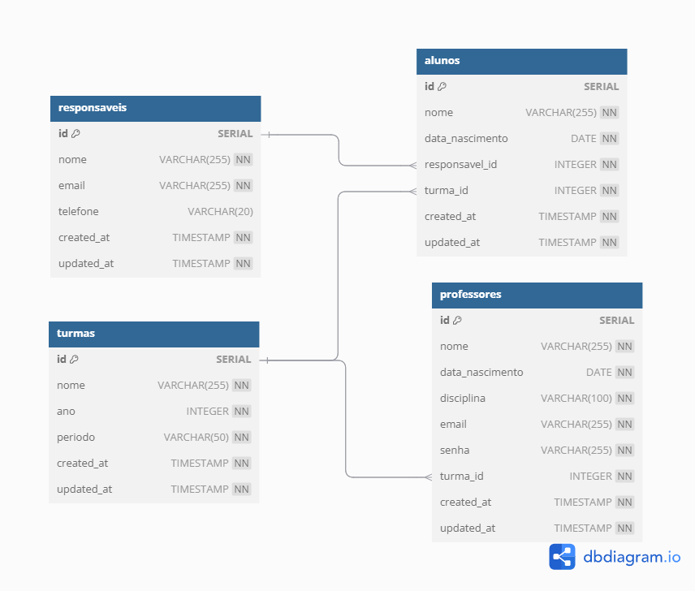

# Sistema de Gerenciamento Escolar

## Iniciando o APP

- Clone o repo 

    ```sh
    git clone https://github.com/Diego0Alves/sistema-de-gerenciamento-escolar.git
    
    ```

- Entre no diretório do repo local

    ```sh

    cd sistema-de-gerenciamento-escolar

    ```

- Crie o .env:

    ```sh

    copy .env.example .env

    ```

> Preencha os dados no .env:

```

POSTGRES_USER=
POSTGRES_PASSWORD=

JWT_SECRET=

```

- Iniciando com Docker

    ```sh

    docker compose up --build

    ```

> Acesse o serviço em:
    [localhost:8080](http://localhost:8080/)

> Acesse o banco de dados na porta 6789 seguindo os dados inseridos no .env

## DER/MER do Banco de Dados:



| Entidade    | Relacionamento    | Entidade  | Cardinalidade  |
| ----------- | ----------------- | --------- | -------------- |
| Responsável | é responsável por | Aluno     | 1\:N           |
| Turma       | possui            | Aluno     | 1\:N           |
| Turma       | é lecionada por   | Professor | 1:1 (ou N:1)   |


### Estrutura de Pastas

```
└── sistema-de-gerenciamento-escolar
    └── app
        └── Commands
            └── ListRoutesCommand.js
        └── Http
            └── Controllers
                └── AlunosApi
                    └── DeleteAlunoController.js
                    └── GetAlunoController.js
                    └── InsertAlunoController.js
                    └── ListAlunoController.js
                    └── UpdateAlunoController.js
                └── dateController.js
                └── LoginJwtController.js
                └── ProfessoresApi
                    └── DeleteProfessorController.js
                    └── GetProfessorController.js
                    └── InsertProfessorController.js
                    └── ListProfessorController.js
                    └── UpdateProfessorController.js
                └── ResponsaveisApi
                    └── DeleteResponsavelController.js
                    └── GetResponsavelController.js
                    └── InsertResponsavelController.js
                    └── ListResponsavelController.js
                    └── UpdateResponsavelController.js
                └── TurmasApi
                    └── DeleteTurmaController.js
                    └── GetTurmaController.js
                    └── InsertTurmaController.js
                    └── ListTurmaController.js
                    └── UpdateTurmaController.js
                └── userController.js
            └── Middlewares
                └── jwtAuthMiddleware.js
        └── Models
            └── alunosModel.js
            └── professoresModel.js
            └── responsaveisModel.js
            └── roleModel.js
            └── turmasModel.js
            └── userModel.js
    └── bootstrap
        └── app.js
        └── constants.js
        └── helpers.js
    └── Core
        └── CommandCore
            └── CommandManager.js
            └── ListRoutes.js
        └── SwaggerCore
            └── CreateSwaggerDocs.js
            └── SwaggerGenerate.js
    └── database
        └── migrations
            └── create_alunos_table.js
            └── create_professores_table.js
            └── create_responsaveis_table.js
            └── create_turmas_table.js
        └── seeds
    └── docker
        └── nginx
            └── default.conf
            └── dockerfile
        └── node-cli
            └── dockerfile
        └── node-web
            └── dockerfile.dev
        └── postgres
            └── init
                └── 01-init.sql
                └── 02-insert.sql
    └── docs
        └── 01-ProfLoginDoc.js
    └── MER-DER
        └── MER-Escola.png
    └── public
        └── index.html
    └── routes
        └── api
        └── api.js
            └── alunosApi.js
            └── professoresApi.js
            └── responsaveisApi.js
            └── turmasApi.js
        └── routes.js
        └── web.js
    └── .env.example
    └── .gitignore
    └── command
    └── docker-compose.yaml
    └── package-lock.json
    └── package.json
    └── README.md
    └── server.js
```